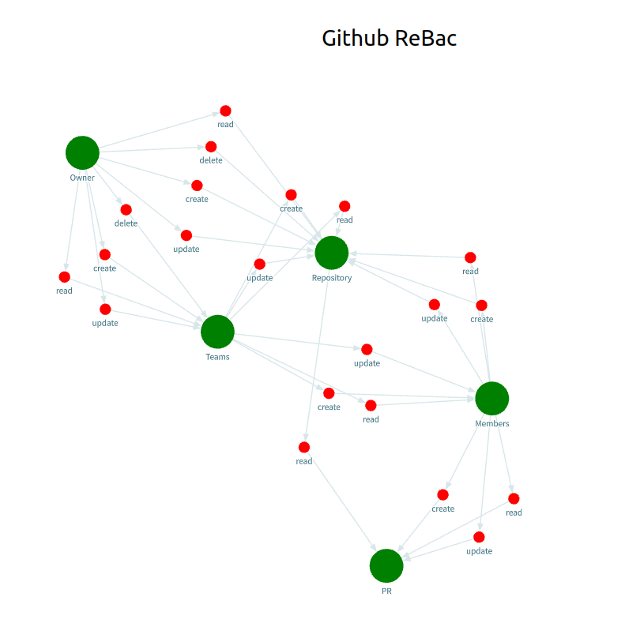

# React + TypeScript + Vite

Generated network graph visualizations using ReaGraph library.


## Installation & FE start

```sh
npm install
npm run dev
```

## Create Policy in server
```sh
npx tsx  src/helpers/create-policy-in-permit.ts
```

## Steps taken to complete the assignment
- Create a simple github ReBac model in permit
- Copy the policy json to this project
- Reduce the policy json to make it more usable in frontend
- Convert policy json to nodes and edges for reagraph library visualization
- Take the nodes data from reagraph visualization to create the original policy in permit using permit sdk

## Screenshots
Frontend Visualization
